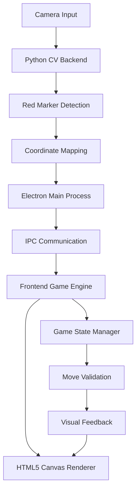
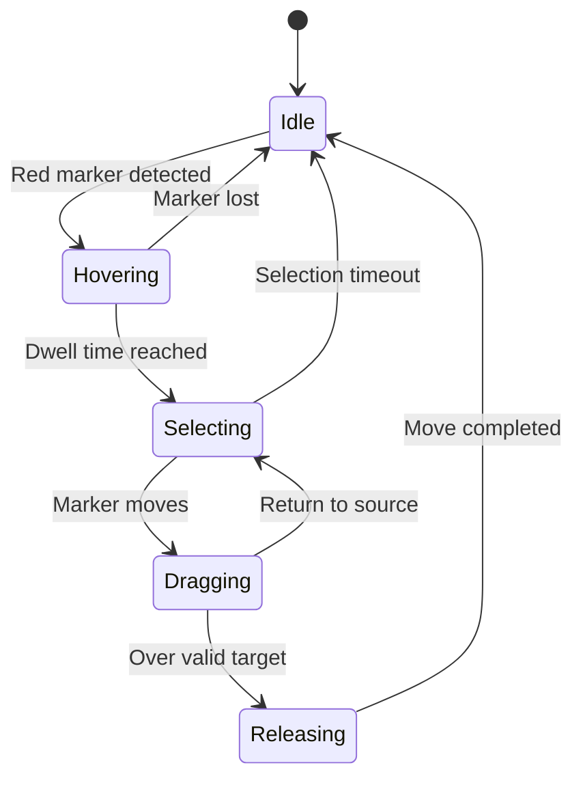

# Computer Vision Checkers Game - Technical Design

## System Architecture Overview



## Current Setup Analysis

**Existing Components:**
- ✅ Electron app with Python backend
- ✅ OpenCV red marker detection ([`backend/detection.py`](backend/detection.py:1))
- ✅ IPC communication ([`preload.js`](preload.js:1), [`index.js`](index.js:1))
- ✅ Real-time coordinate tracking

**Enhancements Needed:**
- Enhanced detection stability and accuracy
- Gesture recognition for touch-and-drag simulation
- Game board coordinate mapping
- Complete checkers game implementation

## Computer Vision Enhancement Design

### 1. Enhanced Detection System

**Current Detection (detection.py):**
- Basic red marker detection using HSV color filtering
- Noise reduction with erosion/dilation
- Center point calculation from largest contour

**Enhancements Needed:**
```python
class EnhancedDetection:
    - Kalman filtering for smooth tracking
    - Multi-frame averaging for stability  
    - Confidence scoring for detection quality
    - Gesture recognition (hover, select, drag)
    - Dead zone handling for jitter reduction
```

**Detection States:**
- `SEARCHING`: Looking for red marker
- `HOVERING`: Marker detected and stable
- `SELECTING`: Marker held over piece (dwell time)
- `DRAGGING`: Marker moving with selected piece
- `RELEASING`: Completing move action

### 2. Coordinate System Mapping

**Camera to Game Board Mapping:**
```javascript
// Board dimensions in pixels (800x800 window)
const BOARD_SIZE = 640; // 8x8 checkers board
const CELL_SIZE = 80;   // Each square is 80x80 pixels
const BOARD_OFFSET = {x: 80, y: 80}; // Center board in window

// Camera coordinate transformation
function cameraToBoard(cameraX, cameraY, cameraWidth, cameraHeight) {
    // Normalize camera coordinates (0-1)
    const normalizedX = cameraX / cameraWidth;
    const normalizedY = cameraY / cameraHeight;
    
    // Map to game board coordinates
    const boardX = normalizedX * BOARD_SIZE + BOARD_OFFSET.x;
    const boardY = normalizedY * BOARD_SIZE + BOARD_OFFSET.y;
    
    // Convert to grid position
    const gridX = Math.floor((boardX - BOARD_OFFSET.x) / CELL_SIZE);
    const gridY = Math.floor((boardY - BOARD_OFFSET.y) / CELL_SIZE);
    
    return {
        pixel: {x: boardX, y: boardY},
        grid: {x: gridX, y: gridY}
    };
}
```

## Game Engine Architecture

### 3. Touch-and-Drag Interaction System

**Interaction Flow:**


**State Management:**
```javascript
class InteractionManager {
    constructor() {
        this.state = 'IDLE';
        this.selectedPiece = null;
        this.dragStart = null;
        this.dwellTimer = null;
        this.dwellThreshold = 1000; // 1 second to select
    }
    
    // Handle vision updates
    updateMarkerPosition(position) {
        const boardPos = cameraToBoard(position.x, position.y);
        
        switch(this.state) {
            case 'IDLE':
                this.handleIdle(boardPos);
                break;
            case 'HOVERING':
                this.handleHovering(boardPos);
                break;
            case 'SELECTING':
                this.handleSelecting(boardPos);
                break;
            case 'DRAGGING':
                this.handleDragging(boardPos);
                break;
        }
    }
}
```

### 4. Checkers Game Engine

**Game State Structure:**
```javascript
class CheckersGame {
    constructor() {
        this.board = this.initializeBoard();
        this.currentPlayer = 'red';
        this.gameState = 'playing'; // 'playing', 'game_over'
        this.selectedSquare = null;
        this.validMoves = [];
    }
    
    initializeBoard() {
        // 8x8 board with pieces in starting positions
        // 'red', 'black', 'red_king', 'black_king', null
        const board = Array(8).fill().map(() => Array(8).fill(null));
        
        // Initialize starting pieces
        for (let row = 0; row < 8; row++) {
            for (let col = 0; col < 8; col++) {
                if ((row + col) % 2 === 1) { // Dark squares only
                    if (row < 3) board[row][col] = 'black';
                    else if (row > 4) board[row][col] = 'red';
                }
            }
        }
        return board;
    }
}
```

### 5. Visual Feedback System

**Canvas Rendering Layers:**
1. **Board Layer**: Checkerboard pattern
2. **Pieces Layer**: Game pieces with animations
3. **Interaction Layer**: Selection highlights, valid moves
4. **Vision Layer**: Red marker position indicator

**Visual States:**
- **Hover Effect**: Subtle glow around hovered piece
- **Selection State**: Bright outline around selected piece
- **Valid Moves**: Highlighted destination squares
- **Drag Preview**: Semi-transparent piece following marker
- **Move Animation**: Smooth piece transitions

## Implementation Strategy

### Phase 1: Enhanced Computer Vision
- Upgrade [`backend/detection.py`](backend/detection.py:1) with gesture recognition
- Add Kalman filtering for smooth tracking
- Implement detection state machine
- Add calibration system for camera-to-board mapping

### Phase 2: Game Engine Core
- Create [`game/checkers-engine.js`](game/checkers-engine.js:1) with complete rules
- Implement move validation and piece logic
- Add turn management and game state tracking
- Create piece promotion system (kings)

### Phase 3: Visual System
- Replace basic HTML with HTML5 Canvas in [`index.html`](index.html:1)
- Create rendering engine for board and pieces
- Implement animation system for moves
- Add visual feedback for all interaction states

### Phase 4: Integration
- Connect computer vision to game engine
- Implement touch-and-drag interaction manager
- Add real-time coordinate mapping
- Integrate all systems with proper error handling

## Technical Specifications

### Computer Vision Enhancements

**Detection Stability:**
```python
class StableDetection:
    def __init__(self):
        self.position_history = deque(maxlen=10)
        self.confidence_threshold = 0.7
        self.stability_threshold = 15  # pixels
        
    def is_stable(self, new_position):
        if len(self.position_history) < 5:
            return False
            
        # Check if position is stable within threshold
        recent_positions = list(self.position_history)[-5:]
        avg_x = sum(p['x'] for p in recent_positions) / 5
        avg_y = sum(p['y'] for p in recent_positions) / 5
        
        distance = math.sqrt((new_position['x'] - avg_x)**2 + 
                           (new_position['y'] - avg_y)**2)
        
        return distance < self.stability_threshold
```

**Gesture Recognition:**
```python
class GestureRecognizer:
    def __init__(self):
        self.dwell_start = None
        self.dwell_threshold = 1.0  # seconds
        self.movement_threshold = 20  # pixels
        
    def update(self, position, timestamp):
        if self.is_dwelling(position):
            if not self.dwell_start:
                self.dwell_start = timestamp
            elif timestamp - self.dwell_start > self.dwell_threshold:
                return 'SELECT'
        else:
            self.dwell_start = None
            
        return 'HOVER' if position else 'NONE'
```

### Performance Optimization

**Frame Rate Management:**
- Target 30 FPS for computer vision processing
- Decouple vision updates from game rendering
- Use requestAnimationFrame for smooth animations
- Implement adaptive quality based on performance

**Memory Management:**
- Limit position history buffers
- Efficient canvas rendering with dirty regions
- Proper cleanup of computer vision resources

## Future Enhancements

1. **Multi-player Support**: Network play with shared vision input
2. **AI Opponent**: Computer player with difficulty levels
3. **Game Recording**: Save and replay games with vision data
4. **Customization**: Adjustable detection sensitivity and board themes
5. **Accessibility**: Voice announcements and keyboard alternatives

## Testing Strategy

1. **Vision Calibration**: Camera positioning and lighting tests
2. **Detection Accuracy**: Red marker tracking precision tests
3. **Gesture Recognition**: Touch-and-drag interaction reliability
4. **Game Logic**: Complete rules validation testing
5. **Performance**: Frame rate and responsiveness benchmarks

This design provides a complete framework for integrating computer vision with a touch-and-drag checkers game, building upon your existing Electron and OpenCV foundation.