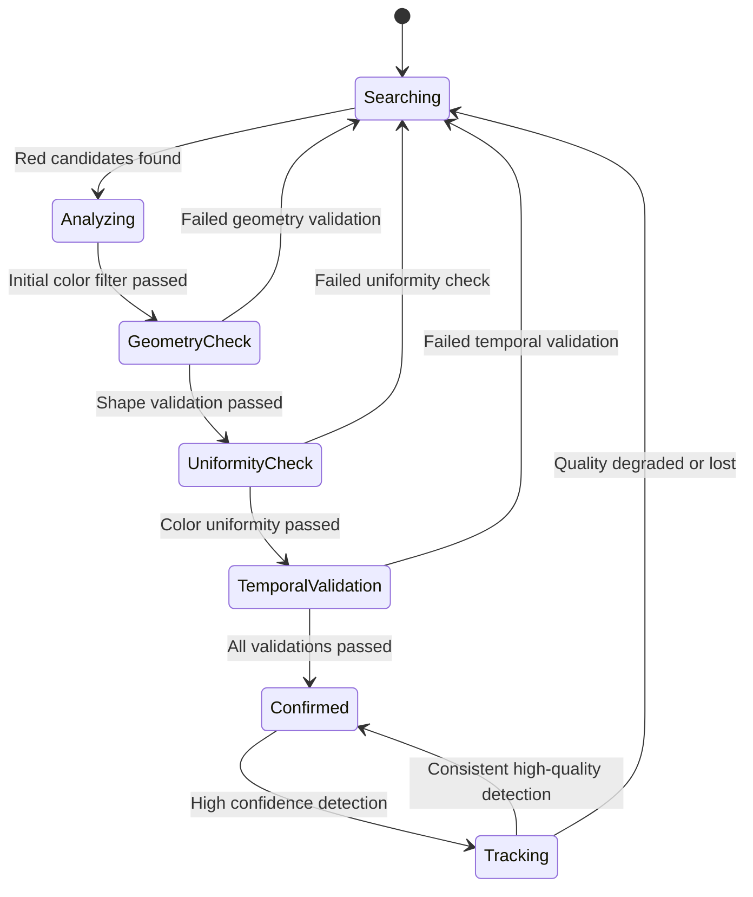

# Enhanced Red Marker Detection System - Implementation Plan

## Overview
Complete rework of the detection module to eliminate false positives from red clothing while maintaining reliable detection of 1-2cm round marker tips (whiteboard marker caps).

## Current System Issues Analysis

### Problems Identified:
1. **False Positives from Red Clothing**: Current HSV ranges too broad (50-255 saturation)
2. **Insufficient Shape Validation**: Only basic area filtering, no geometric constraints
3. **Weak Confidence Scoring**: Simple formula doesn't validate marker properties
4. **No Texture Analysis**: Can't distinguish uniform markers from textured clothing
5. **Low Confidence Threshold**: 0.3 allows too many poor detections
6. **Missing Temporal Validation**: No consistency checking across frames

### Current Detection Flow Issues:
- [`detect_marker()`](backend/detection.py:110) uses overly permissive color ranges
- Confidence calculation only considers circularity and size
- No validation of color uniformity within detected regions
- Kalman filter smooths position but doesn't validate detection quality
- Gesture recognizer accepts low-confidence detections

## Enhanced Detection Architecture

### 1. Multi-Stage Detection Pipeline

```python
class EnhancedMarkerDetection:
    def __init__(self):
        self.color_detector = AdaptiveColorDetector()
        self.geometry_validator = MarkerGeometryValidator()  
        self.uniformity_analyzer = ColorUniformityAnalyzer()
        self.temporal_validator = TemporalConsistencyValidator()
        self.confidence_scorer = MarkerConfidenceScorer()
        
    def detect_marker(self, frame) -> Optional[MarkerPosition]:
        # Stage 1: Adaptive color detection
        candidates = self.color_detector.find_red_candidates(frame)
        if not candidates:
            return None
            
        # Stage 2: Geometric validation  
        valid_contours = []
        for contour in candidates:
            if self.geometry_validator.is_valid_marker(contour):
                valid_contours.append(contour)
                
        # Stage 3: Color uniformity analysis
        uniform_candidates = []
        for contour in valid_contours:
            if self.uniformity_analyzer.has_uniform_color(frame, contour):
                uniform_candidates.append(contour)
                
        # Stage 4: Select best candidate and score confidence
        if uniform_candidates:
            best_contour = self.select_best_candidate(uniform_candidates)
            position = self.extract_position(best_contour)
            
            # Stage 5: Temporal validation and confidence scoring
            return self.temporal_validator.validate_and_score(position)
            
        return None
```

### 2. Adaptive Color Detection

**Tighter HSV Ranges for Markers:**
```python
class AdaptiveColorDetector:
    def __init__(self):
        # Much more restrictive ranges for marker detection
        self.marker_red_ranges = [
            ([0, 120, 120], [10, 255, 255]),    # Primary red - higher saturation
            ([160, 120, 120], [179, 255, 255])  # Wrap-around red
        ]
        # Clothing typically has saturation 50-100, markers 120+
        
    def find_red_candidates(self, frame):
        # Adaptive brightness adjustment based on scene
        # Enhanced morphological operations for small circular objects
        # Noise reduction optimized for 1-2cm objects
```

### 3. Geometric Validation for 1-2cm Round Markers

**Size-Based Constraints:**
```python
class MarkerGeometryValidator:
    def __init__(self):
        # Expected marker properties for 1-2cm diameter
        self.min_area = 50    # Very close camera (30cm)
        self.max_area = 800   # Far camera (100cm)  
        self.min_circularity = 0.75  # Much stricter than current 0.4
        self.min_convexity = 0.9     # Markers are convex, clothing folds aren't
        self.aspect_ratio_range = (0.8, 1.2)  # Nearly circular
        
    def is_valid_marker(self, contour):
        area = cv2.contourArea(contour)
        if not (self.min_area <= area <= self.max_area):
            return False
            
        # Circularity check - much stricter
        perimeter = cv2.arcLength(contour, True)
        if perimeter == 0:
            return False
        circularity = 4 * math.pi * area / (perimeter * perimeter)
        if circularity < self.min_circularity:
            return False
            
        # Convexity check - clothing folds fail this
        hull = cv2.convexHull(contour)
        hull_area = cv2.contourArea(hull)
        convexity = area / hull_area if hull_area > 0 else 0
        if convexity < self.min_convexity:
            return False
            
        # Aspect ratio check
        (x, y, w, h) = cv2.boundingRect(contour)
        aspect_ratio = w / h if h > 0 else 0
        if not (self.aspect_ratio_range[0] <= aspect_ratio <= self.aspect_ratio_range[1]):
            return False
            
        # Compactness check
        compactness = area / (w * h) if (w * h) > 0 else 0
        if compactness < 0.7:  # Circular objects are compact
            return False
            
        return True
```

### 4. Color Uniformity Analysis

**Distinguish Markers from Textured Clothing:**
```python
class ColorUniformityAnalyzer:
    def __init__(self):
        self.max_color_variance = 400  # Low variance for uniform markers
        self.max_brightness_range = 40  # Consistent brightness
        self.min_saturation_consistency = 0.85  # Consistent saturation
        
    def has_uniform_color(self, frame, contour):
        # Extract region inside contour mask
        mask = np.zeros(frame.shape[:2], np.uint8)
        cv2.fillPoly(mask, [contour], 255)
        
        # Get pixels inside the contour
        hsv = cv2.cvtColor(frame, cv2.COLOR_BGR2HSV)
        region_pixels = hsv[mask > 0]
        
        if len(region_pixels) < 10:
            return False
            
        # Color variance check - markers are uniform, clothing isn't
        h_var = np.var(region_pixels[:, 0])
        s_var = np.var(region_pixels[:, 1])  
        v_var = np.var(region_pixels[:, 2])
        total_variance = h_var + s_var + v_var
        
        if total_variance > self.max_color_variance:
            return False
            
        # Brightness consistency check
        v_range = np.max(region_pixels[:, 2]) - np.min(region_pixels[:, 2])
        if v_range > self.max_brightness_range:
            return False
            
        # Saturation consistency - markers have consistent high saturation
        s_mean = np.mean(region_pixels[:, 1])
        s_std = np.std(region_pixels[:, 1])
        saturation_consistency = 1 - (s_std / s_mean) if s_mean > 0 else 0
        
        return saturation_consistency >= self.min_saturation_consistency
```

### 5. Temporal Consistency Validation

**Multi-Frame Validation:**
```python
class TemporalConsistencyValidator:
    def __init__(self):
        self.position_history = deque(maxlen=10)
        self.property_history = deque(maxlen=5)
        self.max_position_jump = 30  # pixels
        self.max_size_change = 0.3   # 30% size change
        
    def validate_and_score(self, current_position):
        # Position stability check
        if self.position_history:
            last_pos = self.position_history[-1]
            distance = math.sqrt((current_position.x - last_pos.x)**2 + 
                               (current_position.y - last_pos.y)**2)
            if distance > self.max_position_jump:
                # Sudden jump - likely false detection
                current_position.confidence *= 0.5
                
        # Property consistency check  
        if len(self.property_history) >= 3:
            # Check size consistency
            recent_sizes = [p.size for p in list(self.property_history)[-3:]]
            size_variance = np.var(recent_sizes)
            if size_variance > (np.mean(recent_sizes) * self.max_size_change)**2:
                current_position.confidence *= 0.7
                
        self.position_history.append(current_position)
        return current_position
```

### 6. Advanced Confidence Scoring

**Multi-Factor Confidence Calculation:**
```python
class MarkerConfidenceScorer:
    def __init__(self):
        self.weights = {
            'geometric': 0.30,    # Shape, size, circularity
            'color': 0.25,        # Hue accuracy, saturation
            'uniformity': 0.25,   # Color consistency, no texture  
            'temporal': 0.20      # Position stability, consistency
        }
        self.min_component_threshold = 0.6  # All components must be reasonable
        
    def calculate_confidence(self, geometric_metrics, color_metrics, 
                           uniformity_metrics, temporal_metrics):
        # Individual component scores
        geometric_score = self.score_geometry(geometric_metrics)
        color_score = self.score_color(color_metrics) 
        uniformity_score = self.score_uniformity(uniformity_metrics)
        temporal_score = self.score_temporal(temporal_metrics)
        
        # Ensure all components meet minimum threshold
        components = [geometric_score, color_score, uniformity_score, temporal_score]
        if any(score < self.min_component_threshold for score in components):
            return 0.0  # Fail if any component is too weak
            
        # Weighted final confidence
        final_confidence = (
            geometric_score * self.weights['geometric'] +
            color_score * self.weights['color'] +  
            uniformity_score * self.weights['uniformity'] +
            temporal_score * self.weights['temporal']
        )
        
        return min(1.0, final_confidence)
```

## Detection State Machine



## Enhanced Output Format

```json
{
    "camera_dimension": {"x": 640, "y": 480},
    "marker": {
        "x": 320, "y": 240,
        "confidence": 0.87,
        "stable": true,
        "detection_state": "CONFIRMED",
        "quality_metrics": {
            "geometric_score": 0.91,
            "color_score": 0.85,
            "uniformity_score": 0.82, 
            "temporal_score": 0.89,
            "area": 245,
            "circularity": 0.86,
            "convexity": 0.94
        }
    },
    "gesture": {
        "state": "HOVER",
        "duration": 0.75,
        "stability": 0.88
    },
    "debug_info": {
        "candidates_found": 3,
        "passed_geometry": 1,
        "passed_uniformity": 1,
        "final_confidence_factors": [0.91, 0.85, 0.82, 0.89]
    }
}
```

## Key Parameter Changes

| Parameter | Current | Enhanced | Reasoning |
|-----------|---------|----------|-----------|
| Color Saturation Min | 50 | 120 | Eliminate clothing false positives |
| Confidence Threshold | 0.3 | 0.75 | Much stricter validation required |
| Circularity Min | ~0.4 | 0.75 | Round markers only |
| Area Range | 500-∞ | 50-800 | Size constraints for 1-2cm markers |
| Convexity Min | None | 0.9 | Eliminate clothing folds |
| Color Variance Max | None | 400 | Uniform color requirement |

## Integration Points

1. **Backend Changes**: Complete rework of [`detect_marker()`](backend/detection.py:110) method
2. **Frontend Integration**: Enhanced confidence data in [`handleVisionData()`](main.js:135)
3. **Interaction Manager**: Use detection_state in [`updateVisionInput()`](frontend/game/interaction-manager.js:35)
4. **Renderer Updates**: Show quality metrics in [`drawDebugInfo()`](frontend/renderer/canvas-renderer.js:482)

## Testing Strategy

1. **Marker Detection**: Test with various lighting conditions and camera distances
2. **False Positive Elimination**: Test with red shirts, backgrounds, objects
3. **Robustness**: Test hand movement patterns, partial occlusion
4. **Performance**: Ensure real-time processing (30+ FPS)
5. **Integration**: Verify game interaction still works smoothly

## Expected Results

- **Eliminate false positives** from red clothing and textured objects
- **Improve detection accuracy** for actual 1-2cm round markers  
- **Maintain real-time performance** with enhanced validation
- **Provide richer debugging information** for tuning and monitoring
- **Enable more reliable gesture recognition** with high-confidence detections

This comprehensive rework addresses all identified issues while maintaining compatibility with the existing game interaction system.